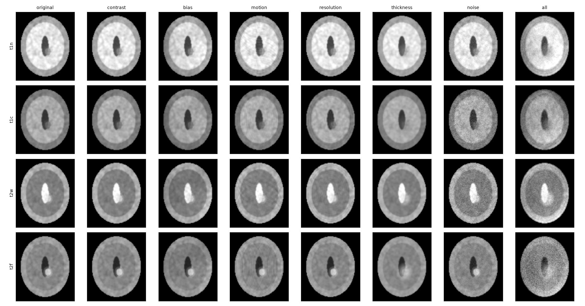

# afriseg

Closing the BraTS 2021 to BraTS-Africa glioma segmentation gap with label-free, calibrated
1.5T acquisition simulation. The study design is in [docs/PROTOCOL.md](docs/PROTOCOL.md) and the
step-by-step Kaggle commands are in [kaggle/RUNBOOK.md](kaggle/RUNBOOK.md).

## Layout

| Path | What it does |
|---|---|
| `src/afriseg/data.py` | Finds BraTS-style NIfTI cases, harmonises labels, crops to the brain, writes `.npz` files and a manifest, and makes the splits |
| `src/afriseg/aug15t.py` | The proposed method: acquisition-physics augmentation |
| `src/afriseg/generic.py` | Control arm: nnU-Net-style intensity augmentation |
| `src/afriseg/quality.py` | Label-free image-quality features |
| `src/afriseg/calibrate.py` | Fits the Aug15T ranges to the target images' quality features |
| `src/afriseg/train.py` | Trains one arm, either source-only or fine-tuning, with time-budget resume |
| `src/afriseg/evaluate.py` | Per-case Dice and HD95 written to CSV |
| `src/afriseg/stats.py` | Paired Wilcoxon test, bootstrap CI, effect size and Holm correction |
| `scripts/preview_aug.py` | Draws a PNG of each degradation |
| `tests/` | Unit tests plus a synthetic end-to-end run on CPU |

## Local setup (CPU, for development and tests)

```bash
python -m venv .venv
.venv/Scripts/python -m pip install torch --index-url https://download.pytorch.org/whl/cpu
.venv/Scripts/python -m pip install -e .[dev]
.venv/Scripts/python -m pytest -q
.venv/Scripts/python scripts/preview_aug.py --out docs/aug_preview_phantom.png
```

All tests run on a synthetic phantom, so no real data is needed. Real training needs a GPU;
see the runbook.


